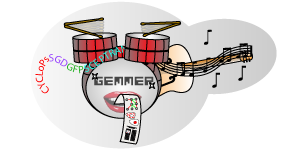

# GEMMER

## About GEMMER
### Motivation
Multi-scale modeling of biological systems requires integration of various information about genes and proteins that are connected together in networks. Spatial, temporal and functional information is available; however, it is still a challenge to retrieve and explore this knowledge in an integrated, quick and user-friendly manner.

### Results
We present GEMMER (GEnome-wide tool for Multi-scale Modeling data Extraction and Representation), a web-based data-integration tool that facilitates high quality visualization of physical, regulatory and genetic interactions between proteins/genes in Saccharomyces cerevisiae. GEMMER creates network visualizations that integrate information on function, temporal expression, localization and abundance from various existing databases. GEMMER supports modeling efforts by effortlessly gathering this information and providing convenient export options for images and their underlying data.

### Availability and implementation
GEMMER is freely available at http://gemmer.barberislab.com. Source code, written in Python, JavaScript library D3js, PHP and JSON, is freely available at https://github.com/barberislab/GEMMER.

## Publication
We are pleased to announce that GEMMER has been accepted for publication in Bioinformatics. You can find the publication [here](https://doi.org/10.1093/bioinformatics/bty052).

## Workflow

